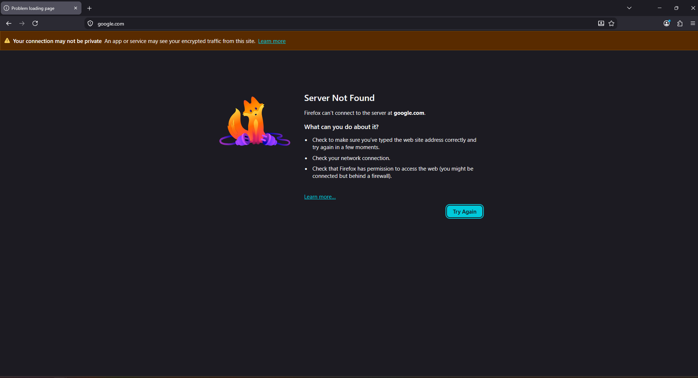
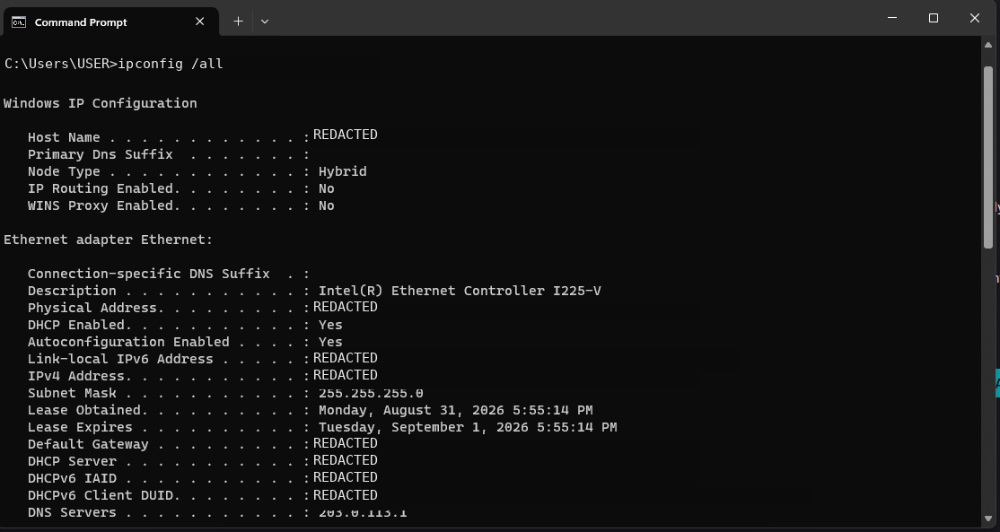
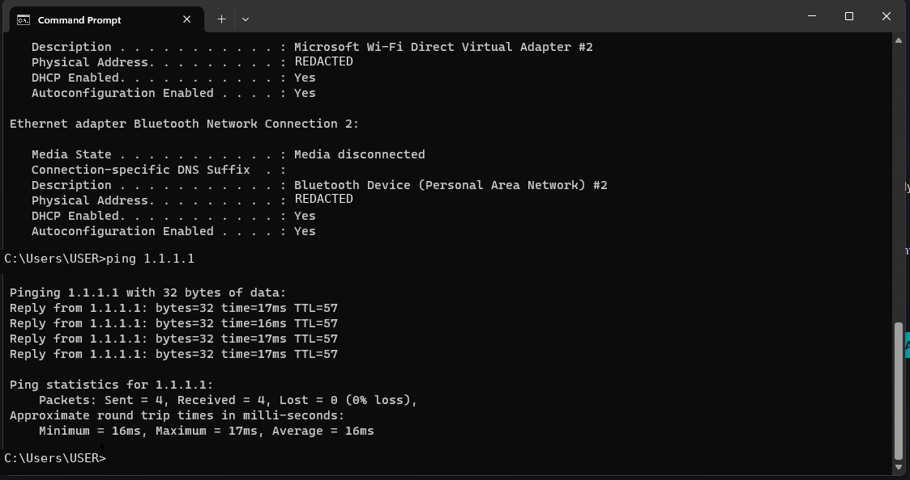
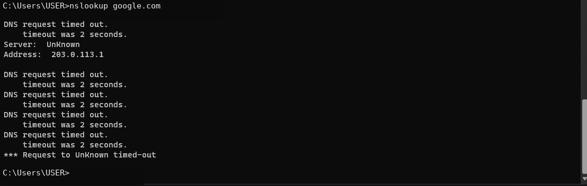
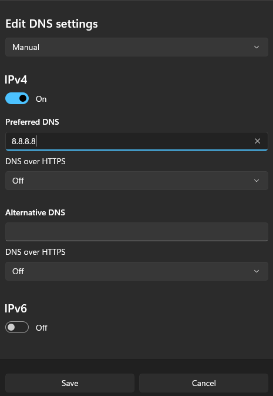
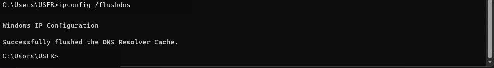
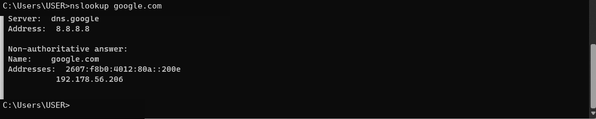
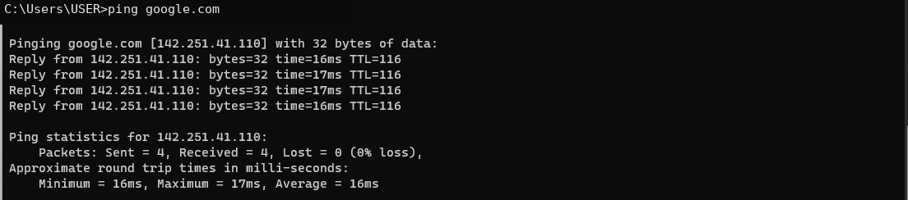

# Ticket 01 — DNS Resolution Failure

> **Lab disclosure:** This is a simulated Windows help desk scenario created for hands-on troubleshooting practice. It is not a real customer incident.

[← Back to Ticket Index](../README.md)

## Reported Issue

The workstation appeared connected to the network, but websites could not be reached by hostname. Firefox returned a **Server Not Found** error for `google.com`.

## Troubleshooting

1. Confirmed the browser could not reach `google.com`.
2. Reviewed the workstation network configuration with `ipconfig /all`.
3. Tested raw IP connectivity with `ping 1.1.1.1`; the ping succeeded, showing that basic IP connectivity was working.
4. Tested name resolution with `nslookup google.com`; the DNS request timed out.
5. Identified the configured DNS server as `203.0.113.1`, intentionally set as a non-working DNS value for this lab.

## Root Cause

The workstation had an incorrect DNS server configured. Network connectivity was available, but hostname resolution was failing.

## Resolution

Changed the preferred IPv4 DNS server to the known-good public resolver `8.8.8.8`, then cleared the local DNS resolver cache with:

```cmd
ipconfig /flushdns
```

## Verification

- `nslookup google.com` successfully returned DNS results.
- `ping google.com` successfully resolved the hostname and received replies.
- Hostname connectivity was restored.

## Commands Used

```cmd
ipconfig /all
ping 1.1.1.1
nslookup google.com
ipconfig /flushdns
ping google.com
```

## Evidence

### 1. Reported symptom


### 2. Incorrect DNS configuration identified


### 3. Raw IP connectivity confirmed


### 4. DNS resolution failure confirmed


### 5. DNS configuration corrected


### 6. DNS resolver cache cleared


### 7. DNS resolution restored


### 8. Hostname connectivity verified


## Skills Demonstrated

- Windows network troubleshooting
- TCP/IP connectivity testing
- DNS troubleshooting
- Command Prompt diagnostics
- Root-cause isolation
- Resolution verification
- Technical documentation
