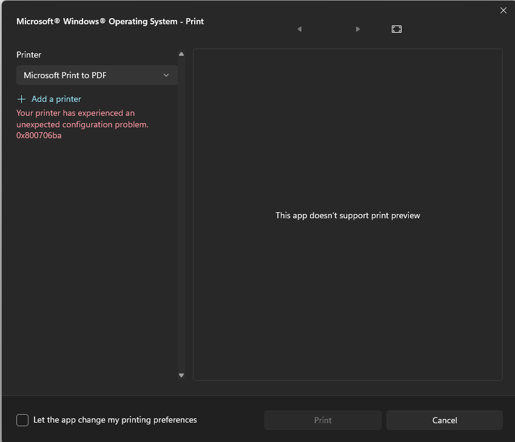
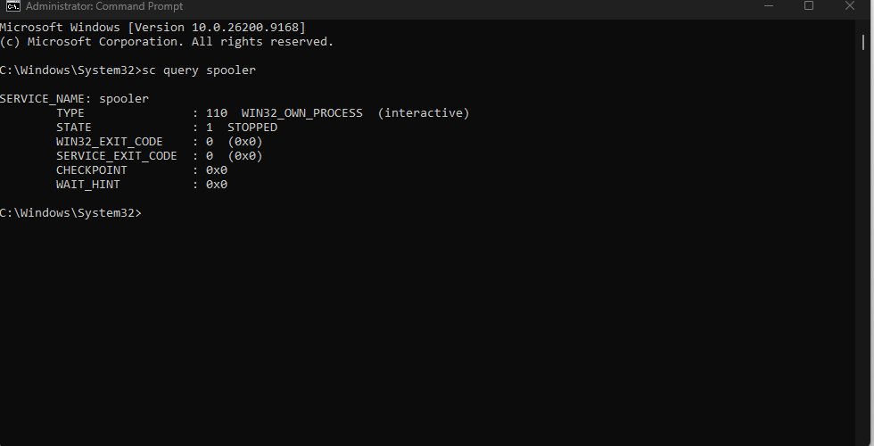
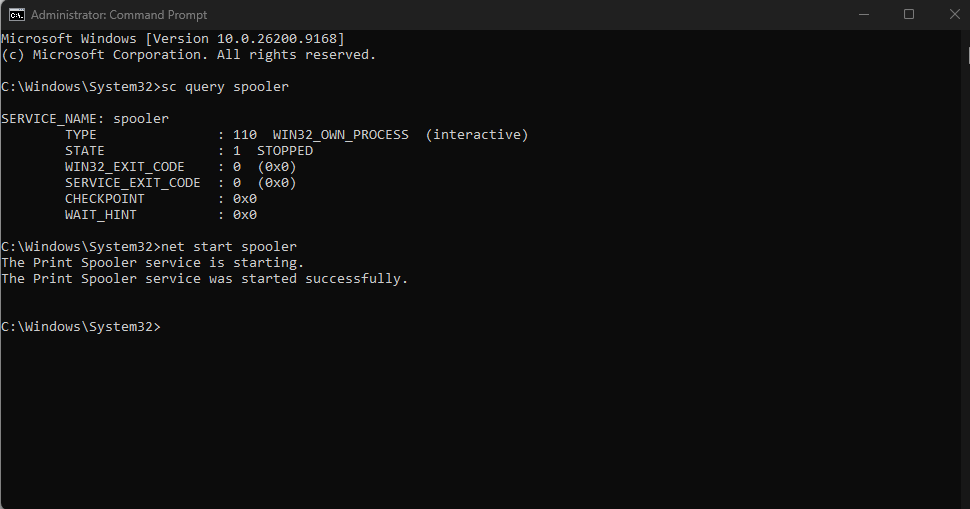
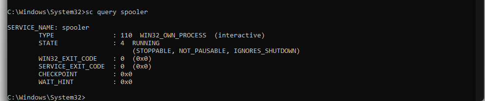

# Ticket 02 — Print Spooler Service Failure

> **Lab disclosure:** This is a simulated Windows help desk scenario created for hands-on troubleshooting practice. It is not a real customer incident.

[← Back to Ticket Index](../README.md)

## Reported Issue

The user could not print using **Microsoft Print to PDF**. Windows displayed an unexpected printer configuration error and the print action was unavailable.

## Troubleshooting

1. Reproduced the printing failure in the Windows print dialog.
2. Checked the Print Spooler service from an elevated Command Prompt with `sc query spooler`.
3. Confirmed the service state was `STOPPED`.
4. Identified the unavailable Print Spooler service as the immediate cause of the printing failure.

## Root Cause

The Windows **Print Spooler** service was stopped, preventing Windows from processing print jobs.

## Resolution

Restarted the Print Spooler service from an elevated Command Prompt:

```cmd
net start spooler
```

Windows confirmed that the service started successfully.

## Verification

Ran `sc query spooler` again and confirmed the service state had changed to `RUNNING`.

## Commands Used

```cmd
sc query spooler
net start spooler
sc query spooler
```

## Evidence

### 1. Printing failure reproduced


### 2. Print Spooler confirmed stopped


### 3. Print Spooler restarted


### 4. Service status verified


## Skills Demonstrated

- Windows printer troubleshooting
- Windows Services diagnostics
- Elevated Command Prompt
- Service-state verification
- Root-cause isolation
- Technical documentation
