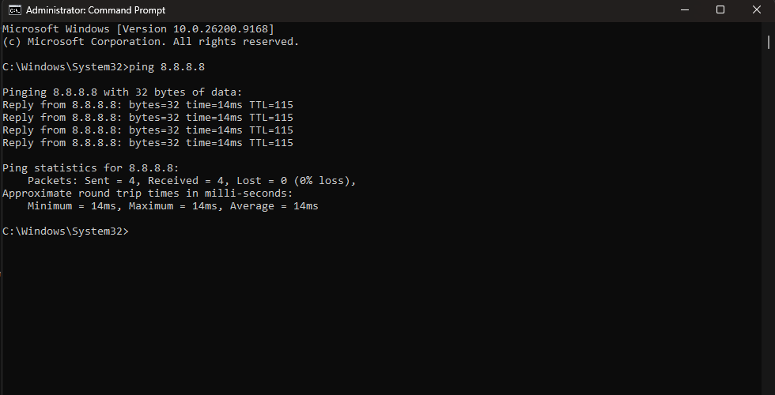
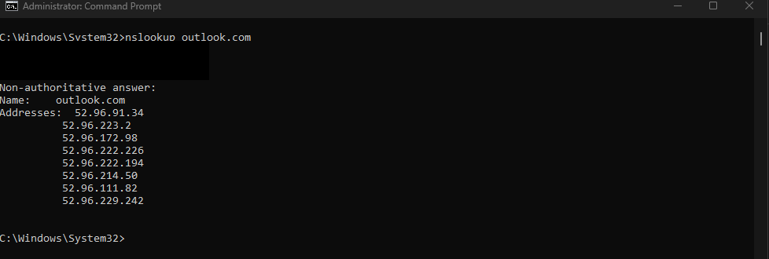

# Ticket 03 — Outlook Offline Mode

> **Lab disclosure:** This is a simulated Windows help desk scenario created for hands-on troubleshooting practice. It is not a real customer incident.

[← Back to Ticket Index](../README.md)

## Reported Issue

Microsoft Outlook was unable to send or receive mail even though the workstation appeared to have network connectivity.

## Troubleshooting

1. Confirmed basic IP connectivity with `ping 8.8.8.8`; replies were received with no packet loss.
2. Confirmed DNS resolution with `nslookup outlook.com`; the hostname resolved successfully.
3. With network connectivity and name resolution working, isolated the issue to the Outlook client rather than the underlying network.
4. Reviewed Outlook's **Send/Receive** controls and found **Work Offline** enabled.

## Root Cause

Microsoft Outlook was configured in **Work Offline** mode, preventing normal online synchronization with the mail service.

## Resolution

Disabled **Work Offline** from Outlook's **Send/Receive** tab and allowed the client to reconnect and synchronize.

## Verification

- Confirmed basic IP connectivity remained operational.
- Confirmed DNS resolution remained operational.
- Confirmed Outlook reported **Connected to: Microsoft Exchange** after Work Offline was disabled.
- Confirmed mailbox synchronization resumed.

## Commands Used

```cmd
ping 8.8.8.8
nslookup outlook.com
```

## Evidence

### 1. Basic IP connectivity confirmed


### 2. DNS resolution confirmed


### 3. Work Offline identified


### 4. Work Offline disabled


### 5. Exchange connectivity restored


## Skills Demonstrated

- Microsoft Outlook troubleshooting
- End-user email support
- TCP/IP connectivity testing
- DNS validation
- Application-level fault isolation
- Microsoft Exchange client connectivity verification
- Resolution verification
- Technical documentation
