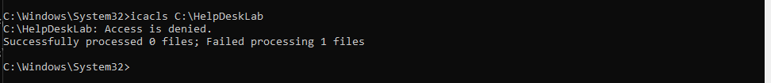
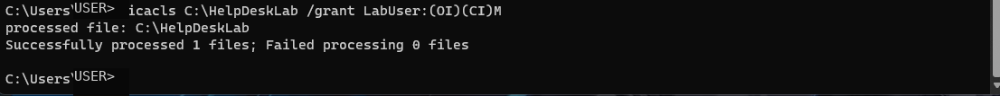
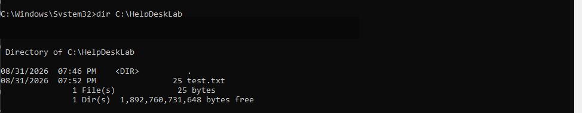
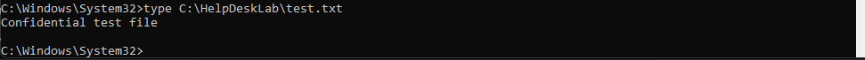

# Ticket 04 — Windows NTFS Permissions / Access Denied

> **Lab disclosure:** This is a simulated Windows help desk scenario created for hands-on troubleshooting practice. It is not a real customer incident.

[← Back to Ticket Index](../README.md)

## Reported Issue

A user was unable to access a required local work folder and received an **Access is denied** error.

## Troubleshooting

1. Reproduced the access failure against `C:\HelpDeskLab`.
2. Attempted to inspect the folder ACL with `icacls` and confirmed that access to the folder was blocked.
3. Used administrative privileges to recover ownership of the lab folder with `takeown`.
4. Restored administrative control of the folder and reviewed the NTFS access control list.
5. Granted the affected `LabUser` account the required **Modify** permission.
6. Re-ran `icacls` to confirm the updated ACL.

## Root Cause

The user account did not have the NTFS permissions required to access the folder.

## Resolution

Recovered administrative ownership/control of the lab folder and granted `LabUser` Modify permission using Windows command-line tools.

```cmd
takeown /f C:\HelpDeskLab /r /d y
icacls C:\HelpDeskLab /grant Administrators:(OI)(CI)F /t
icacls C:\HelpDeskLab /grant LabUser:(OI)(CI)M
```

## Verification

- Confirmed the updated ACL with `icacls`.
- Confirmed the user could list the contents of `C:\HelpDeskLab`.
- Confirmed the test file could be opened and read successfully.

## Commands Used

```cmd
icacls C:\HelpDeskLab
takeown /f C:\HelpDeskLab /r /d y
icacls C:\HelpDeskLab /grant Administrators:(OI)(CI)F /t
icacls C:\HelpDeskLab /grant LabUser:(OI)(CI)M
dir C:\HelpDeskLab
type C:\HelpDeskLab\test.txt
```

## Enterprise Context

This lab uses local NTFS permissions and `icacls` intentionally so the underlying ACL and ownership concepts are visible. In managed environments, access is commonly assigned through security groups rather than granting permissions to users one at a time. With Active Directory or Microsoft Entra ID integrated storage such as Azure Files, group-based access can make permission administration more consistent and scalable.

## Evidence

### 1. Access failure reproduced


### 2. Administrative ownership recovered


### 3. Required user permission granted


### 4. ACL update verified


### 5. Folder access restored


### 6. File access verified


## Skills Demonstrated

- Windows NTFS permissions
- ACL troubleshooting
- File/folder ownership recovery
- `icacls` and `takeown`
- Least-privilege access concepts
- End-user access troubleshooting
- Resolution verification
- Technical documentation
