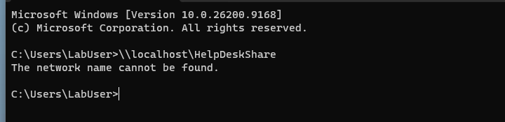
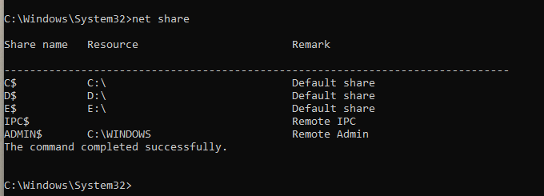
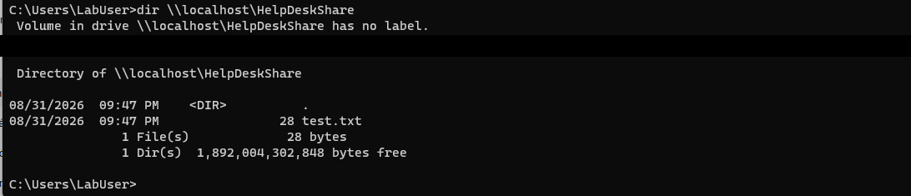
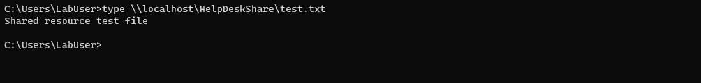

# Ticket 05 — Shared Folder Unavailable

> **Lab disclosure:** This is a simulated Windows help desk scenario created for hands-on troubleshooting practice. It is not a real customer incident.

[← Back to Ticket Index](../README.md)

## Reported Issue

A user could not access the expected network share at `\\localhost\HelpDeskShare`.

## Troubleshooting

1. Reproduced the failure from the `LabUser` account.
2. Confirmed the system itself was reachable with `ping localhost`.
3. Ran `net share` and confirmed `HelpDeskShare` was missing from the published SMB shares.
4. Restored the share for `C:\HelpDeskShare`.
5. Tested the UNC path again from the affected user account.

## Root Cause

The folder still existed locally, but the expected SMB share was no longer published.

## Resolution

Restored the `HelpDeskShare` Windows file share and allowed the test user to access it.

## Verification

- `\\localhost\HelpDeskShare` could be listed successfully.
- `test.txt` was visible in the shared folder.
- The test file could be read through the UNC path.

## Commands Used

```cmd
ping localhost
net share
net share HelpDeskShare=C:\HelpDeskShare /grant:LabUser,CHANGE
dir \\localhost\HelpDeskShare
type \\localhost\HelpDeskShare\test.txt
```

## Evidence

### 1. Share access failure reproduced


### 2. Expected share missing from `net share`


### 3. Share access restored


### 4. File access verified


## Skills Demonstrated

- Windows file sharing
- SMB / UNC paths
- Basic network troubleshooting
- `net share`
- End-user access troubleshooting
- Resolution verification
- Technical documentation
